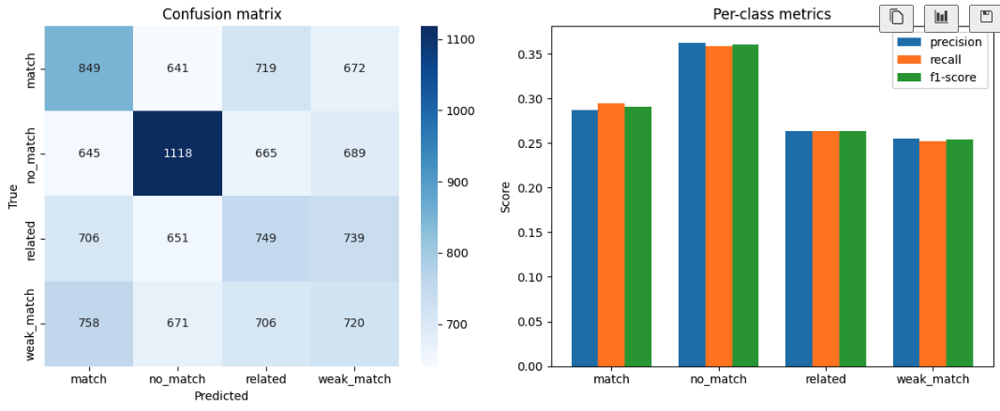

# Report with RandomForest + Cosine similarities and all data

## Сравнение: маленький vs большой сбалансированный датасет

| | маленький | большой |
|---|---|---|
| **Данные** | 1 652 (по 413 на класс) | 56 584 (по 14 146 на класс) |
| **Test accuracy** | 0.25 | 0.2937 |
| **Test macro-F1** | 0.25 | 0.29 |
| **match F1** | 0.16 | 0.29 |
| **no_match F1** | 0.41 | 0.36 |
| **related F1** | 0.25 | 0.26 |
| **weak_match F1** | 0.18 | 0.25 |

## Что показывает эксперимент

1. **Увеличение данных улучшило macro-F1.** На маленьком датасете macro-F1 = 0.25 (фактически на уровне случайного угадывания), на большом — 0.29. Рост небольшой, но показывает, что дополнительные данные помогают модели лучше разделять классы, хотя общее качество остаётся низким.

2. **Метрики стали стабильнее и ровнее.** На маленьком датасете разброс F1 по классам значительный (0.16–0.41), на большом — более ровный (0.25–0.36). Больше данных снижает случайность в оценках и выравнивает качество по классам.

## Что нужно для качественного скачка

Эксперимент показал, что задача требует **смены подхода**, а не увеличения данных. Наиболее перспективное направление — **Deep Learning с эмбеддингами**:

- вместо сжатия 384-мерных эмбеддингов в одно число (cosine similarity), подать сырые эмбеддинги (rfq + supplier + multilingual) в нейронную сеть, которая сама найдёт нелинейные комбинации признаков. В отличие от RandomForest, нейросеть может обучаться на всех 384 измерениях одновременно.

Именно большой датасет (56k) делает Deep Learning реальным вариантом — на 1 652 примерах нейросеть бы переобучилась, а на 56k уже есть достаточно данных для обучения.

